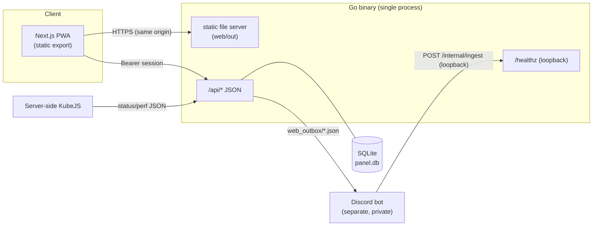

# mc_sv-panel

[한국어](README.md) | **English**

An **authenticated, installable PWA dashboard for a Minecraft server** — live
player status, real-time performance charts, and a three-way (game ↔ Discord ↔
web) chat bridge. A statically-exported Next.js front end served by a single,
dependency-free Go binary.

<!-- Badges resolve once the repo is public under your account. -->
[](https://github.com/Kim-Geonwoo/mc-panel-pwa/actions/workflows/ci.yml)
[](LICENSE)

> **Try it without any backend:** run in demo mode (`PANEL_DEMO=true`) and log in
> with the code `000000` — the panel serves built-in sample data, no Discord bot
> or game server required. See [Run locally](#run-locally).

<!-- TODO: add screenshots/GIF here -->
<!--  -->

## Features

- **Code-based auth** — a companion Discord bot rotates a 6-digit code; entering
  it creates a **server-side, revocable session** (2-day TTL).
- **Live status** — online players (name + ping), TPS/MSPT, peak concurrency,
  auto-refresh, "server offline" state.
- **Performance view** — real-time TPS / MSPT / p95 / tick-spike charts (uPlot)
  with an in-memory rolling history.
- **Three-way chat** — game, Discord, and web messages in one feed; web users
  pick a nickname and post back into the game.
- **PWA** — installable, offline app shell via a service worker; light/dark.
- **Hardened** — loopback-bound API behind a tunnel, server-side sessions,
  per-IP/-session rate limiting, input sanitization, strict security headers.

## Architecture



The Go API is the chat hub. Chat and timeline records live in SQLite
(`panel.db`); the bot is a pure bridge that forwards game/Discord events over a
loopback internal API (falling back to JSON files, which an importer picks up).
Status/perf are read from JSON files written by server-side KubeJS — and
[demo mode](#run-locally) replaces all of these integrations with sample data.

## Tech stack

| Layer | Tech |
|---|---|
| Front end | Next.js (App Router) · TypeScript · Tailwind CSS · Framer Motion · uPlot · PWA |
| Back end | Go (standard library + `modernc.org/sqlite` — **pure Go, no CGO**) |
| Delivery | Static export (`output: 'export'`) served by Go; HTTPS via tunnel |
| CI/CD | GitHub Actions · CodeQL · OSV-Scanner · Trivy · gitleaks · Renovate |

## Authentication model

1. The Go API generates and rotates the 6-digit code in `auth.json`; the Discord bot only displays it (login works even without the bot).
2. User submits the code → `POST /api/login` compares it (constant-time) and, on
   match, creates a session in `sessions.json`, returning an opaque random id (`sid`).
3. The client stores the `sid` and sends `Authorization: Bearer <sid>`.
4. Every request validates the `sid` server-side (exists, not expired, not
   revoked). An admin can revoke any session out-of-band (`web_revoked.json`),
   so access can be cut immediately — unlike a stateless signed token.

## API

| Method | Path | Auth | Description |
|---|---|---|---|
| POST | `/api/login` | — | `{code}` → `{token}`. 401 on mismatch, 429 when rate-limited |
| POST | `/api/logout` | Bearer | Invalidates the session |
| GET | `/api/me` | Bearer | `{nickname}` |
| POST | `/api/nickname` | Bearer | Set the web nickname (unique, sanitized) |
| GET | `/api/status` | Bearer | Server up/down, players, TPS/MSPT, peak concurrency |
| GET | `/api/perf` | Bearer | Live perf sample + rolling history (charts) |
| GET/POST | `/api/chat` | Bearer | Read the merged feed (`since` forward poll · `before` history) / post a web message (returns `{id,ts}` on store) |
| GET | `/api/timeline` | Bearer | Join/leave events for the timeline tab |
| GET | `/healthz` | — | Loopback-only liveness probe (uptime monitoring) |
| * | `/internal/*` | loopback | Bot-only internal API (ingest, session list/revoke) — never on the exposed listener |

## Run locally

**Demo mode (no backend services needed):**

```bash
# Front end
cd web && npm ci && npm run build      # -> web/out

# Back end (serves the static site + sample API)
cd ../api && go build -o mc_sv-panel .
PANEL_DEMO=true PANEL_STATIC_DIR=../web/out ./mc_sv-panel
# open http://localhost:8080  — login code: 000000
```

**Docker demo:**

```bash
docker build -t mc-panel-pwa .
docker run --rm -p 8080:8080 mc-panel-pwa   # demo mode by default (code 000000)
```

**Front-end dev server (hot reload):** run the Go API and Next dev on split
origins — `NEXT_PUBLIC_API_BASE=http://localhost:8080` for the front end and
`PANEL_ALLOW_ORIGIN=http://localhost:3000` for the Go side.

All configuration is environment-driven; see [`.env.example`](.env.example).

## Build & deploy

```bash
./build.sh   # static export (web/out) + Go binary (api/mc_sv-panel)
```

The Go binary serves both the static site and the API, so deployment is a single
process behind any HTTPS reverse proxy or tunnel. A **demo build/branch** simply
sets `PANEL_DEMO=true` and can be hosted anywhere the static + Go artifact runs.

## Security

Supply-chain and code security are automated end-to-end — CodeQL (SAST),
OSV-Scanner + Trivy (SCA/IaC), gitleaks + GitHub push protection (secrets), and
Renovate with a release cooldown and CI-gated auto-merge. Details and reporting:
[`.github/SECURITY.md`](.github/SECURITY.md).

## Project layout

```
api/      Go backend (main.go, demo.go) — API + static server + /healthz
web/      Next.js app (App Router, components, lib, PWA assets)
build.sh  build both halves
.github/  CI + security workflows, templates, policy
```

## Planned Changes

> The following changes are in progress and will be implemented in a separate session alongside the Discord bot.

### 1. Chat architecture — bot-centric → web-centric ✅ (done)

Previously the Discord bot was the hub for all chat, and even login codes and session revocation were bot artifacts — without the bot the web panel was effectively dead. The Go API is now the hub.

| | Before | Now |
| --- | --- | --- |
| Storage/reads | Bot writes `chat.json` → API reads the file | **API stores and serves from SQLite directly** |
| Web → Game | Web → `web_outbox/` → Bot → Game | Web → **API store (feed updates instantly)** → `web_outbox/` → Bot → Game/Discord |
| Login codes | Bot generates & rotates | **API generates & rotates** (`PANEL_CODE_ROTATE_SEC`, default 6h) — the bot only displays them on Discord |
| Session admin | Bot writes `web_revoked.json` | **Internal API** (`/internal/sessions` · `/internal/revoke`, loopback-only) — the file path remains for legacy compatibility |
| Without bot | No login, no web message delivery | **Login and web chat work standalone** (only game/Discord delivery waits) |

- The bot is demoted to a pure bridge: it forwards game/Discord events to the API via loopback `POST /internal/ingest` (falling back to the legacy files on failure — the importer picks those up) and handles delivery/display only.
- There is a single id authority — the DB. The importer uses file ids only as a progress cursor and assigns fresh DB ids.
- Remaining follow-up: delivering **web → game without the bot** requires a KubeJS file-queue channel. Deliberately deferred so full-privilege RCON credentials never move into the internet-exposed API.

### 2. Chat storage — JSON file → SQLite ✅ (done)

Reading the entire `chat.json` on every request became linearly slower as messages accumulated, so storage moved to SQLite.

- Driver: `modernc.org/sqlite` — a single pure-Go, CGO-free dependency (build environment stays simple)
- The cursor is **`id`-based**, not `ts`-based — a ts cursor can skip messages that land in the same millisecond, while the id cursor stays compatible with the existing frontend (`since=last_id`)
- Timeline (join/leave) events share the same DB, with size managed by a retention window (`PANEL_TIMELINE_RETENTION_DAYS`, default 90 days)
- During the transition an importer ingests the bot-written `chat.json`/`timeline.json` into the DB every 2s (the first run doubles as the one-time migration). The importer goes away once §1 lands
- DB path: `PANEL_DB` (default `<bridge>/panel.db`), WAL mode, single writer

```sql
-- Implemented schema
CREATE TABLE messages (
    id      INTEGER PRIMARY KEY AUTOINCREMENT,
    ts      INTEGER NOT NULL,
    source  TEXT NOT NULL,  -- 'game' | 'discord' | 'web'
    uuid    TEXT NOT NULL DEFAULT '',
    user    TEXT NOT NULL,
    text    TEXT NOT NULL
);
CREATE INDEX idx_messages_ts ON messages(ts);
-- timeline(id, ts, ts_kst, uuid, name, event, is_first) + idx_timeline_ts
```

- `GET /api/chat?since=<id>` → `SELECT ... WHERE id > ? ORDER BY id` (no full-file parse)

## License

[MIT](LICENSE)
