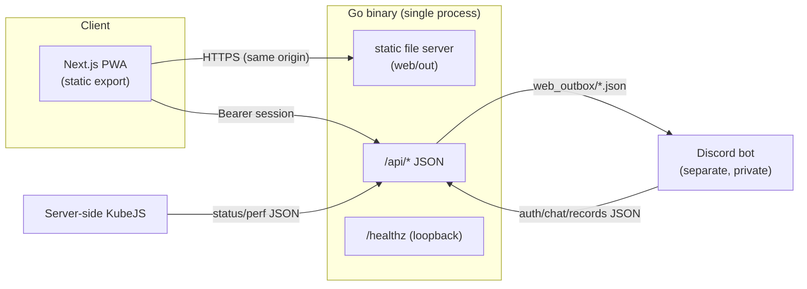

# mc_sv-panel

[한국어](README.md) | **English**

An **authenticated, installable PWA dashboard for a Minecraft server** — live
player status, real-time performance charts, and a three-way (game ↔ Discord ↔
web) chat bridge. A statically-exported Next.js front end served by a single,
dependency-free Go binary.

<!-- Badges resolve once the repo is public under your account. -->
[](https://github.com/Kim-Geonwoo/mc-panel-pwa/actions/workflows/ci.yml)
[](LICENSE)

> **Try it without any backend:** run in demo mode (`PANEL_DEMO=true`) and log in
> with the code `000000` — the panel serves built-in sample data, no Discord bot
> or game server required. See [Run locally](#run-locally).

<!-- TODO: add screenshots/GIF here -->
<!--  -->

## Features

- **Code-based auth** — a companion Discord bot rotates a 6-digit code; entering
  it creates a **server-side, revocable session** (2-day TTL).
- **Live status** — online players (name + ping), TPS/MSPT, peak concurrency,
  auto-refresh, "server offline" state.
- **Performance view** — real-time TPS / MSPT / p95 / tick-spike charts (uPlot)
  with an in-memory rolling history.
- **Three-way chat** — game, Discord, and web messages in one feed; web users
  pick a nickname and post back into the game.
- **PWA** — installable, offline app shell via a service worker; light/dark.
- **Hardened** — loopback-bound API behind a tunnel, server-side sessions,
  per-IP/-session rate limiting, input sanitization, strict security headers.

## Architecture



The panel never talks to the game or Discord directly. **The only integration
surface is JSON files on disk** that the bot and the server-side KubeJS script
write — which is exactly what [demo mode](#run-locally) replaces with sample data.

## Tech stack

| Layer | Tech |
|---|---|
| Front end | Next.js (App Router) · TypeScript · Tailwind CSS · Framer Motion · uPlot · PWA |
| Back end | Go (standard library only — **no third-party deps**) |
| Delivery | Static export (`output: 'export'`) served by Go; HTTPS via tunnel |
| CI/CD | GitHub Actions · CodeQL · OSV-Scanner · Trivy · gitleaks · Renovate |

## Authentication model

1. The Discord bot writes a rotating 6-digit code to `auth.json`.
2. User submits the code → `POST /api/login` compares it (constant-time) and, on
   match, creates a session in `sessions.json`, returning an opaque random id (`sid`).
3. The client stores the `sid` and sends `Authorization: Bearer <sid>`.
4. Every request validates the `sid` server-side (exists, not expired, not
   revoked). An admin can revoke any session out-of-band (`web_revoked.json`),
   so access can be cut immediately — unlike a stateless signed token.

## API

| Method | Path | Auth | Description |
|---|---|---|---|
| POST | `/api/login` | — | `{code}` → `{token}`. 401 on mismatch, 429 when rate-limited |
| POST | `/api/logout` | Bearer | Invalidates the session |
| GET | `/api/me` | Bearer | `{nickname}` |
| POST | `/api/nickname` | Bearer | Set the web nickname (unique, sanitized) |
| GET | `/api/status` | Bearer | Server up/down, players, TPS/MSPT, peak concurrency |
| GET | `/api/perf` | Bearer | Live perf sample + rolling history (charts) |
| GET/POST | `/api/chat` | Bearer | Read the merged feed / post a web message |
| GET | `/healthz` | — | Loopback-only liveness probe (uptime monitoring) |

## Run locally

**Demo mode (no backend services needed):**

```bash
# Front end
cd web && npm ci && npm run build      # -> web/out

# Back end (serves the static site + sample API)
cd ../api && go build -o mc_sv-panel .
PANEL_DEMO=true PANEL_STATIC_DIR=../web/out ./mc_sv-panel
# open http://localhost:8080  — login code: 000000
```

**Front-end dev server (hot reload):** run the Go API and Next dev on split
origins — `NEXT_PUBLIC_API_BASE=http://localhost:8080` for the front end and
`PANEL_ALLOW_ORIGIN=http://localhost:3000` for the Go side.

All configuration is environment-driven; see [`.env.example`](.env.example).

## Build & deploy

```bash
./build.sh   # static export (web/out) + Go binary (api/mc_sv-panel)
```

The Go binary serves both the static site and the API, so deployment is a single
process behind any HTTPS reverse proxy or tunnel. A **demo build/branch** simply
sets `PANEL_DEMO=true` and can be hosted anywhere the static + Go artifact runs.

## Security

Supply-chain and code security are automated end-to-end — CodeQL (SAST),
OSV-Scanner + Trivy (SCA/IaC), gitleaks + GitHub push protection (secrets), and
Renovate with a release cooldown and CI-gated auto-merge. Details and reporting:
[`.github/SECURITY.md`](.github/SECURITY.md).

## Project layout

```
api/      Go backend (main.go, demo.go) — API + static server + /healthz
web/      Next.js app (App Router, components, lib, PWA assets)
build.sh  build both halves
.github/  CI + security workflows, templates, policy
```

## Planned Changes

> The following changes are in progress and will be implemented in a separate session alongside the Discord bot.

### 1. Chat architecture — bot-centric → web-centric

Currently the Discord bot is the sole hub for all chat messages. Without the bot, messages sent from the web cannot reach the game.

**After the change:** The Go API becomes the chat hub; the bot handles only the Discord ↔ game bridge. Web chat works independently even without the bot.

| | Current | After |
| --- | --- | --- |
| Web → Game | Web → `web_outbox/` → Bot → Game | Web → API → Game (direct) |
| Hub | Discord bot | Go API server |
| Without bot | Web messages not delivered | Web chat works independently |

### 2. Chat storage — JSON file → SQLite

Reading the entire `chat.json` on every request becomes linearly slower as messages accumulate.

**After the change:** SQLite with an index on `ts`, so `since`-based polling is a simple indexed lookup. No new external dependencies — Go standard stack is preserved.

```sql
-- Planned schema
CREATE TABLE messages (
    id      INTEGER PRIMARY KEY,
    ts      INTEGER NOT NULL,
    source  TEXT NOT NULL,  -- 'game' | 'discord' | 'web'
    uuid    TEXT,
    user    TEXT NOT NULL,
    text    TEXT NOT NULL
);
CREATE INDEX idx_messages_ts ON messages(ts);
```

- `GET /api/chat?since=<ts>` → `SELECT ... WHERE ts > ?` (no full-file parse)
- Driver: `modernc.org/sqlite` (no CGO required)

## License

[MIT](LICENSE)
