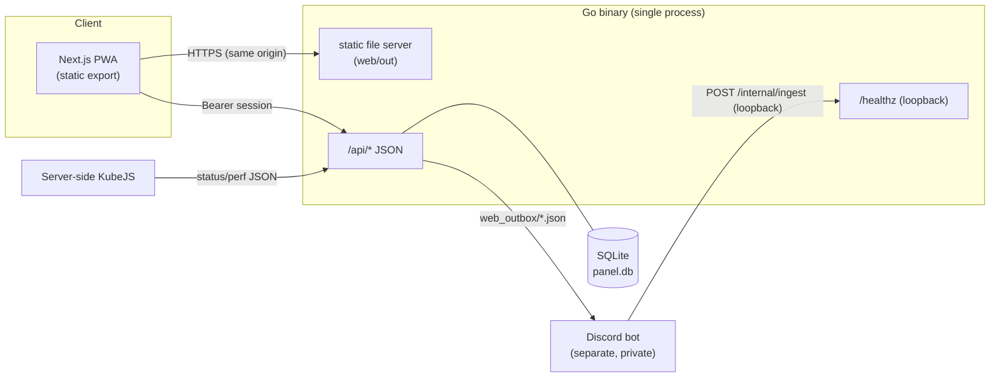

# mc-panel-pwa

[한국어](README.md) | **English**

[](https://github.com/Kim-Geonwoo/mc-panel-pwa/actions/workflows/ci.yml)
[](https://scorecard.dev/viewer/?uri=github.com/Kim-Geonwoo/mc-panel-pwa)
[](https://www.bestpractices.dev/projects/13554)
[](https://go.dev/)
[](https://github.com/Kim-Geonwoo/mc-panel-pwa/releases)
[](LICENSE)

> A personal project, built and maintained as a hobby. Issues and PRs are welcome, but support is best-effort.

An **authenticated, installable PWA dashboard for a Minecraft server** — live
player status, real-time performance charts, and a three-way (game ↔ Discord ↔
web) chat bridge. A statically-exported Next.js front end served by a single,
dependency-free Go binary.

> **Live demo:** <https://mc-panel-demo.geonwoo.dev> — login code `000000`.
>
> **Run it yourself:** demo mode (`PANEL_DEMO=true`) serves built-in sample data —
> no Discord bot or game server required. See [Run locally](#run-locally); for a
> one-line run, see [`demo/`](demo/).

## Features

- **Code-based auth** — a companion Discord bot rotates a 6-digit code; entering
  it creates a **server-side, revocable session** (2-day TTL).
- **Live status** — online players (name + ping), TPS/MSPT, peak concurrency,
  auto-refresh, "server offline" state.
- **Performance view** — real-time TPS / MSPT / p95 / tick-spike charts (uPlot)
  with an in-memory rolling history.
- **Three-way chat** — game, Discord, and web messages in one feed; web users
  pick a nickname and post back into the game.
- **PWA** — installable, offline app shell via a service worker; light/dark.
- **Hardened** — loopback-bound API behind a tunnel, server-side sessions,
  per-IP/-session rate limiting, input sanitization, strict security headers.

## Architecture



The Go API is the chat hub. Chat and timeline records live in SQLite
(`panel.db`); the bot is a pure bridge that forwards game/Discord events over a
loopback internal API (falling back to JSON files, which an importer picks up).
Status/perf are read from JSON files written by server-side KubeJS — and
[demo mode](#run-locally) replaces all of these integrations with sample data.

## Tech stack

| Layer | Tech |
|---|---|
| Front end | Next.js (App Router) · TypeScript · Tailwind CSS · Framer Motion · uPlot · PWA |
| Back end | Go (standard library + `modernc.org/sqlite` — **pure Go, no CGO**) |
| Delivery | Static export (`output: 'export'`) served by Go; HTTPS via tunnel |
| CI/CD | GitHub Actions · CodeQL · OSV-Scanner · Trivy · gitleaks · Renovate |

## Authentication model

1. The Go API generates and rotates the 6-digit code in `auth.json`; the Discord bot only displays it (login works even without the bot).
2. User submits the code → `POST /api/login` compares it (constant-time) and, on
   match, creates a session in `sessions.json`, returning an opaque random id (`sid`).
3. The client stores the `sid` and sends `Authorization: Bearer <sid>`.
4. Every request validates the `sid` server-side (exists, not expired, not
   revoked). An admin can revoke any session out-of-band (`web_revoked.json`),
   so access can be cut immediately — unlike a stateless signed token.

## API

| Method | Path | Auth | Description |
|---|---|---|---|
| POST | `/api/login` | — | `{code}` → `{token}`. 401 on mismatch, 429 when rate-limited |
| POST | `/api/logout` | Bearer | Invalidates the session |
| GET | `/api/me` | Bearer | `{nickname}` |
| POST | `/api/nickname` | Bearer | Set the web nickname (unique, sanitized) |
| GET | `/api/status` | Bearer | Server up/down, players, TPS/MSPT, peak concurrency |
| GET | `/api/perf` | Bearer | Live perf sample + rolling history (charts) |
| GET/POST | `/api/chat` | Bearer | Read the merged feed (`since` forward poll · `before` history) / post a web message (returns `{id,ts}` on store) |
| GET | `/api/timeline` | Bearer | Join/leave events for the timeline tab |
| GET/POST | `/api/push/config` · `/api/push/subscribe` · `/api/push/unsubscribe` | Bearer | Web push (VAPID): config (key + server-enabled kinds via `PANEL_PUSH_EVENTS`), subscribe (per-kind `topics`), unsubscribe — server down/up + join alerts. iOS needs 16.4+ home-screen install |
| GET | `/healthz` | — | Loopback-only liveness probe (uptime monitoring) |
| * | `/internal/*` | loopback | Bot-only internal API (ingest, session list/revoke) — never on the exposed listener |

## Run locally

**Demo mode (no backend services needed):**

```bash
# Front end
cd web && npm ci && npm run build      # -> web/out

# Back end (serves the static site + sample API)
cd ../api && go build -o mc_sv-panel .
PANEL_DEMO=true PANEL_STATIC_DIR=../web/out ./mc_sv-panel
# open http://localhost:8080  — login code: 000000
```

**Docker demo:**

```bash
docker build -t mc-panel-pwa .
docker run --rm -p 8080:8080 mc-panel-pwa   # demo mode by default (code 000000)
```

**Front-end dev server (hot reload):** run the Go API and Next dev on split
origins — `NEXT_PUBLIC_API_BASE=http://localhost:8080` for the front end and
`PANEL_ALLOW_ORIGIN=http://localhost:3000` for the Go side.

All configuration is environment-driven; see [`.env.example`](.env.example).

## Build & deploy

```bash
./build.sh   # static export (web/out) + Go binary (api/mc_sv-panel)
```

The Go binary serves both the static site and the API, so deployment is a single
process behind any HTTPS reverse proxy or tunnel. A **demo build/branch** simply
sets `PANEL_DEMO=true` and can be hosted anywhere the static + Go artifact runs.

## Security

Supply-chain and code security are automated end-to-end — CodeQL (SAST),
OSV-Scanner + Trivy (SCA/IaC), gitleaks + GitHub push protection (secrets), and
Renovate with a release cooldown and CI-gated auto-merge. Details and reporting:
[`.github/SECURITY.md`](.github/SECURITY.md).

## Project layout

```
api/      Go backend (main.go, demo.go) — API + static server + /healthz
web/      Next.js app (App Router, components, lib, PWA assets)
demo/     demo run kit (run-demo.sh · docker-compose.yml) — runs the current main source
build.sh  build both halves
.github/  CI + security workflows, templates, policy
```

## Planned Changes

Roadmap, with status per item:

- [ ] Retire the legacy file importer once the private Discord bot fully migrates to `POST /internal/ingest`
- [ ] Build-time locale for PWA metadata (document title, manifest, push fallback text)
- [ ] Unit tests for the web UI (the Go API is at ~82% statement coverage)
- [ ] README screenshots

## License

[MIT](LICENSE)
