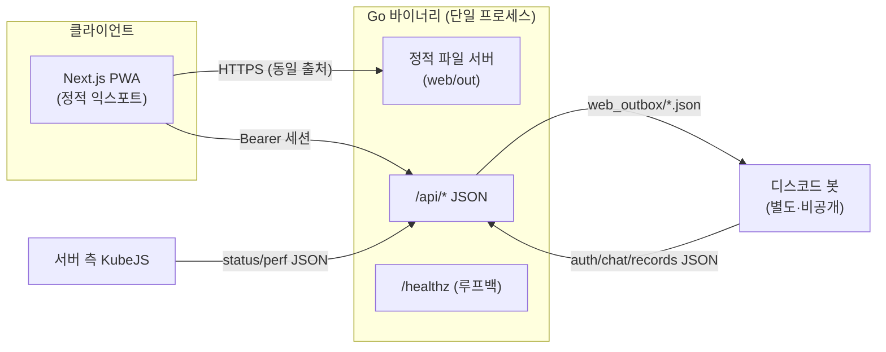

# mc_sv-panel

**한국어** | [English](README.en.md)

마인크래프트 서버용 **인증형 설치 가능 PWA 대시보드**입니다. 실시간 접속 현황, 실시간
성능 차트, 그리고 게임 ↔ 디스코드 ↔ 웹을 잇는 3방향 채팅을 제공합니다. 정적으로 익스포트한
Next.js 프런트엔드를, 외부 의존성이 없는 단일 Go 바이너리가 서빙합니다.

<!-- 저장소가 본인 계정으로 공개되면 배지가 정상 동작합니다. -->
[](https://github.com/Kim-Geonwoo/mc-panel-pwa/actions/workflows/ci.yml)
[](LICENSE)

> **백엔드 없이 바로 실행해 보기:** 데모 모드(`PANEL_DEMO=true`)로 띄우고 로그인 코드
> `000000`을 입력하면, 디스코드 봇이나 게임 서버 없이 내장 샘플 데이터로 동작합니다.
> [로컬 실행](#로컬-실행) 참고.

<!-- TODO: 스크린샷/GIF 추가 -->
<!--  -->

## 주요 기능

- **코드 기반 인증** — 디스코드 봇이 6자리 코드를 주기적으로 갱신하고, 이 코드를 입력하면
  **서버 측에서 관리되며 회수 가능한 세션**(2일 유효)이 생성됩니다.
- **실시간 현황** — 접속자(이름 + 핑), TPS/MSPT, 최대 동시접속, 자동 갱신, 서버 오프라인 상태 표시.
- **성능 뷰** — TPS / MSPT / p95 / 틱 스파이크를 실시간 라인 차트(uPlot)로, 메모리에 누적한 이력과 함께.
- **3방향 채팅** — 게임·디스코드·웹 메시지를 한 피드에서. 웹 사용자는 닉네임을 정하고 게임으로 글을 보냅니다.
- **PWA** — 서비스 워커로 설치 가능·오프라인 앱 셸 지원, 라이트/다크 테마.
- **보안 강화** — 터널 뒤 루프백 바인딩 API, 서버 측 세션, IP·세션별 레이트 리밋,
  입력 새니타이즈, 엄격한 보안 헤더.

## 아키텍처



패널은 게임이나 디스코드와 직접 통신하지 않습니다. **유일한 연동 지점은 디스크 위의 JSON
파일**로, 봇과 서버 측 KubeJS 스크립트가 이 파일들을 씁니다. [데모 모드](#로컬-실행)는 바로
이 파일들을 샘플 데이터로 대체한 것입니다.

## 기술 스택

| 레이어 | 기술 |
|---|---|
| 프런트엔드 | Next.js (App Router) · TypeScript · Tailwind CSS · Framer Motion · uPlot · PWA |
| 백엔드 | Go (표준 라이브러리만 — **외부 의존성 없음**) |
| 서빙 | Go가 정적 익스포트(`output: 'export'`)를 서빙, HTTPS는 터널 경유 |
| CI/CD | GitHub Actions · CodeQL · OSV-Scanner · Trivy · gitleaks · Renovate |

## 인증 모델

1. 디스코드 봇이 6자리 코드를 주기적으로 `auth.json`에 기록합니다.
2. 사용자가 코드를 제출하면 `POST /api/login`이 이를 (상수 시간으로) 비교하고, 일치하면
   `sessions.json`에 세션을 만들어 불투명한 랜덤 id(`sid`)를 돌려줍니다.
3. 클라이언트는 `sid`를 저장하고 `Authorization: Bearer <sid>`로 전송합니다.
4. 모든 요청은 `sid`를 서버 측에서 검증합니다(존재·미만료·미회수). 관리자는 세션을 즉시
   회수할 수 있어(`web_revoked.json`), 무상태 서명 토큰과 달리 접근을 바로 끊을 수 있습니다.

## API

| 메서드 | 경로 | 인증 | 설명 |
|---|---|---|---|
| POST | `/api/login` | — | `{code}` → `{token}`. 불일치 401, 레이트 리밋 시 429 |
| POST | `/api/logout` | Bearer | 세션 무효화 |
| GET | `/api/me` | Bearer | `{nickname}` |
| POST | `/api/nickname` | Bearer | 웹 닉네임 설정(고유·새니타이즈) |
| GET | `/api/status` | Bearer | 서버 가동 여부, 접속자, TPS/MSPT, 최대 동시접속 |
| GET | `/api/perf` | Bearer | 실시간 성능 샘플 + 누적 이력(차트용) |
| GET/POST | `/api/chat` | Bearer | 통합 피드 읽기 / 웹 메시지 전송 |
| GET | `/healthz` | — | 루프백 전용 헬스 체크(가동 모니터링용) |

## 로컬 실행

**데모 모드(백엔드 서비스 불필요):**

```bash
# 프런트엔드
cd web && npm ci && npm run build      # -> web/out

# 백엔드 (정적 사이트 + 샘플 API 서빙)
cd ../api && go build -o mc_sv-panel .
PANEL_DEMO=true PANEL_STATIC_DIR=../web/out ./mc_sv-panel
# http://localhost:8080 접속 — 로그인 코드: 000000
```

**프런트엔드 개발 서버(핫 리로드):** Go API와 Next 개발 서버를 서로 다른 출처로 띄웁니다 —
프런트엔드에 `NEXT_PUBLIC_API_BASE=http://localhost:8080`, Go 쪽에 `PANEL_ALLOW_ORIGIN=http://localhost:3000`.

모든 설정은 환경 변수로 주입합니다. [`.env.example`](.env.example) 참고.

## 빌드 & 배포

```bash
./build.sh   # 정적 익스포트(web/out) + Go 바이너리(api/mc_sv-panel)
```

Go 바이너리가 정적 사이트와 API를 함께 서빙하므로, 배포는 HTTPS 리버스 프록시나 터널 뒤의
단일 프로세스로 끝납니다. **데모 빌드/브랜치**는 `PANEL_DEMO=true`만 주면 되고, 정적 + Go
산출물을 실행할 수 있는 어디서든 호스팅할 수 있습니다.

## 보안

공급망과 코드 보안을 처음부터 끝까지 자동화했습니다 — CodeQL(SAST), OSV-Scanner + Trivy(SCA/IaC),
gitleaks + GitHub 푸시 보호(시크릿), 그리고 릴리스 쿨다운과 CI 통과 게이트를 둔 Renovate 자동병합.
자세한 내용과 취약점 신고: [`.github/SECURITY.md`](.github/SECURITY.md).

## 프로젝트 구조

```
api/      Go 백엔드 (main.go, demo.go) — API + 정적 서버 + /healthz
web/      Next.js 앱 (App Router, components, lib, PWA 자산)
build.sh  양쪽 빌드
.github/  CI + 보안 워크플로, 템플릿, 정책
```

## 패치 예정

> 아래 변경사항은 현재 개발 중이며, 별도 세션에서 디스코드 봇과 함께 작업할 예정입니다.

### 1. 채팅 아키텍처 — 봇 중심 → 웹 중심 전환

현재는 디스코드 봇이 모든 채팅 메시지의 허브 역할을 합니다. 봇이 없으면 웹에서 보낸 메시지가 게임에 전달되지 않습니다.

**변경 후:** 웹 API가 채팅의 중심이 되고, 봇은 디스코드 ↔ 게임 브리지 역할만 담당합니다. 봇이 없는 환경에서도 웹 채팅이 독립적으로 동작합니다.

| | 현재 | 변경 후 |
| --- | --- | --- |
| 웹 → 게임 | 웹 → `web_outbox/` → 봇 → 게임 | 웹 → API → 게임 (직접) |
| 허브 | 디스코드 봇 | Go API 서버 |
| 봇 없을 때 | 웹 메시지 전달 불가 | 웹 채팅 독립 동작 |

### 2. 채팅 저장소 — JSON 파일 → SQLite 전환

현재 `chat.json`을 통째로 읽는 방식은 메시지가 쌓일수록 성능이 선형으로 나빠집니다.

**변경 후:** SQLite로 전환하여 `since` 조회를 인덱스로 처리합니다. 외부 의존성 없이 Go 표준 스택 유지.

```sql
-- 예정 스키마
CREATE TABLE messages (
    id      INTEGER PRIMARY KEY,
    ts      INTEGER NOT NULL,
    source  TEXT NOT NULL,  -- 'game' | 'discord' | 'web'
    uuid    TEXT,
    user    TEXT NOT NULL,
    text    TEXT NOT NULL
);
CREATE INDEX idx_messages_ts ON messages(ts);
```

- `GET /api/chat?since=<ts>` → `SELECT ... WHERE ts > ?` (전체 파일 파싱 불필요)
- Go: `modernc.org/sqlite` (CGO 불필요) 또는 표준 `database/sql` + 드라이버

## 라이선스

[MIT](LICENSE)
