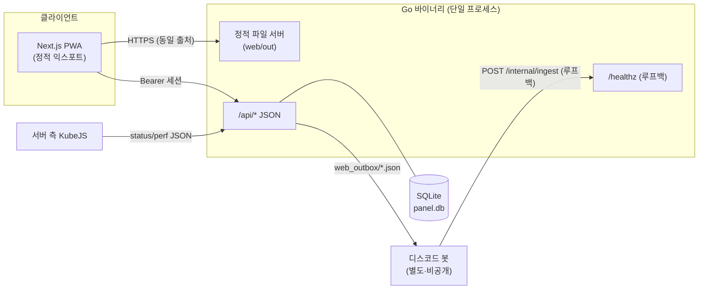

# mc-panel-pwa

**한국어** | [English](README.en.md)

[](https://github.com/Kim-Geonwoo/mc-panel-pwa/actions/workflows/ci.yml)
[](https://scorecard.dev/viewer/?uri=github.com/Kim-Geonwoo/mc-panel-pwa)
[](https://www.bestpractices.dev/projects/13554)
[](https://go.dev/)
[](https://github.com/Kim-Geonwoo/mc-panel-pwa/releases)
[](LICENSE)

> 개인이 취미로 만들고 유지보수하는 프로젝트입니다. 이슈·PR은 환영하지만 지원은 베스트에포트로 이뤄집니다.

마인크래프트 서버용 **인증형 설치 가능 PWA 대시보드**입니다. 실시간 접속 현황, 실시간
성능 차트, 그리고 게임 ↔ 디스코드 ↔ 웹을 잇는 3방향 채팅을 제공합니다. 정적으로 익스포트한
Next.js 프런트엔드를, 외부 의존성이 없는 단일 Go 바이너리가 서빙합니다.

> **백엔드 없이 바로 실행해 보기:** 데모 모드(`PANEL_DEMO=true`)로 띄우고 로그인 코드
> `000000`을 입력하면, 디스코드 봇이나 게임 서버 없이 내장 샘플 데이터로 동작합니다.
> [로컬 실행](#로컬-실행) 참고. 한 줄 실행은 [`demo/`](demo/)를 참조하십시오.

## 주요 기능

- **코드 기반 인증** — 디스코드 봇이 6자리 코드를 주기적으로 갱신하고, 이 코드를 입력하면
  **서버 측에서 관리되며 회수 가능한 세션**(2일 유효)이 생성됩니다.
- **실시간 현황** — 접속자(이름 + 핑), TPS/MSPT, 최대 동시접속, 자동 갱신, 서버 오프라인 상태 표시.
- **성능 뷰** — TPS / MSPT / p95 / 틱 스파이크를 실시간 라인 차트(uPlot)로, 메모리에 누적한 이력과 함께.
- **3방향 채팅** — 게임·디스코드·웹 메시지를 한 피드에서. 웹 사용자는 닉네임을 정하고 게임으로 글을 보냅니다.
- **PWA** — 서비스 워커로 설치 가능·오프라인 앱 셸 지원, 라이트/다크 테마.
- **보안 강화** — 터널 뒤 루프백 바인딩 API, 서버 측 세션, IP·세션별 레이트 리밋,
  입력 새니타이즈, 엄격한 보안 헤더.

## 아키텍처



Go API가 채팅 허브입니다. 채팅·타임라인은 SQLite(`panel.db`)에 저장되고, 봇은 게임·디스코드
이벤트를 루프백 내부 API로 넘기는 순수 브리지입니다(실패 시 JSON 파일 폴백 → 임포터가 수습).
상태·성능은 서버 측 KubeJS가 쓰는 JSON 파일을 읽습니다. [데모 모드](#로컬-실행)는 이
연동들을 샘플 데이터로 대체한 것입니다.

## 기술 스택

| 레이어 | 기술 |
|---|---|
| 프런트엔드 | Next.js (App Router) · TypeScript · Tailwind CSS · Framer Motion · uPlot · PWA |
| 백엔드 | Go (표준 라이브러리 + `modernc.org/sqlite` — **CGO 없는 순수 Go**) |
| 서빙 | Go가 정적 익스포트(`output: 'export'`)를 서빙, HTTPS는 터널 경유 |
| CI/CD | GitHub Actions · CodeQL · OSV-Scanner · Trivy · gitleaks · Renovate |

## 인증 모델

1. Go API가 6자리 코드를 주기적으로 생성해 `auth.json`에 기록하고, 디스코드 봇은 이를 표시만 합니다(봇이 없어도 로그인 동작).
2. 사용자가 코드를 제출하면 `POST /api/login`이 이를 (상수 시간으로) 비교하고, 일치하면
   `sessions.json`에 세션을 만들어 불투명한 랜덤 id(`sid`)를 돌려줍니다.
3. 클라이언트는 `sid`를 저장하고 `Authorization: Bearer <sid>`로 전송합니다.
4. 모든 요청은 `sid`를 서버 측에서 검증합니다(존재·미만료·미회수). 관리자는 세션을 즉시
   회수할 수 있어(`web_revoked.json`), 무상태 서명 토큰과 달리 접근을 바로 끊을 수 있습니다.

## API

| 메서드 | 경로 | 인증 | 설명 |
|---|---|---|---|
| POST | `/api/login` | — | `{code}` → `{token}`. 불일치 401, 레이트 리밋 시 429 |
| POST | `/api/logout` | Bearer | 세션 무효화 |
| GET | `/api/me` | Bearer | `{nickname}` |
| POST | `/api/nickname` | Bearer | 웹 닉네임 설정(고유·새니타이즈) |
| GET | `/api/status` | Bearer | 서버 가동 여부, 접속자, TPS/MSPT, 최대 동시접속 |
| GET | `/api/perf` | Bearer | 실시간 성능 샘플 + 누적 이력(차트용) |
| GET/POST | `/api/chat` | Bearer | 통합 피드 읽기(`since`=전방 폴링·`before`=과거 로딩) / 웹 메시지 전송(저장 즉시 `{id,ts}` 반환) |
| GET | `/api/timeline` | Bearer | 접속 이벤트(join/leave) — 타임라인 탭용 |
| GET/POST | `/api/push/config` · `/api/push/subscribe` · `/api/push/unsubscribe` | Bearer | 웹 푸시(VAPID) 구성 조회(키+서버가 켠 알림 종류 `PANEL_PUSH_EVENTS`)·구독(종류 선택 `topics`)·해지 — 서버 다운/복구·접속 알림. iOS는 16.4+ 홈 화면 설치 시 |
| GET | `/healthz` | — | 루프백 전용 헬스 체크(가동 모니터링용) |
| * | `/internal/*` | 루프백 | 봇 전용 내부 API(수집·세션 목록·회수) — 인터넷 노출 리스너에는 없음 |

## 로컬 실행

**데모 모드(백엔드 서비스 불필요):**

```bash
# 프런트엔드
cd web && npm ci && npm run build      # -> web/out

# 백엔드 (정적 사이트 + 샘플 API 서빙)
cd ../api && go build -o mc_sv-panel .
PANEL_DEMO=true PANEL_STATIC_DIR=../web/out ./mc_sv-panel
# http://localhost:8080 접속 — 로그인 코드: 000000
```

**Docker 데모:**

```bash
docker build -t mc-panel-pwa .
docker run --rm -p 8080:8080 mc-panel-pwa   # 기본이 데모 모드(코드 000000)
```

**프런트엔드 개발 서버(핫 리로드):** Go API와 Next 개발 서버를 서로 다른 출처로 띄웁니다 —
프런트엔드에 `NEXT_PUBLIC_API_BASE=http://localhost:8080`, Go 쪽에 `PANEL_ALLOW_ORIGIN=http://localhost:3000`.

모든 설정은 환경 변수로 주입합니다. [`.env.example`](.env.example) 참고.

## 빌드 & 배포

```bash
./build.sh   # 정적 익스포트(web/out) + Go 바이너리(api/mc_sv-panel)
```

Go 바이너리가 정적 사이트와 API를 함께 서빙하므로, 배포는 HTTPS 리버스 프록시나 터널 뒤의
단일 프로세스로 끝납니다. **데모 빌드/브랜치**는 `PANEL_DEMO=true`만 주면 되고, 정적 + Go
산출물을 실행할 수 있는 어디서든 호스팅할 수 있습니다.

## 보안

공급망과 코드 보안을 처음부터 끝까지 자동화했습니다 — CodeQL(SAST), OSV-Scanner + Trivy(SCA/IaC),
gitleaks + GitHub 푸시 보호(시크릿), 그리고 릴리스 쿨다운과 CI 통과 게이트를 둔 Renovate 자동병합.
자세한 내용과 취약점 신고: [`.github/SECURITY.md`](.github/SECURITY.md).

## 프로젝트 구조

```
api/      Go 백엔드 (main.go, demo.go) — API + 정적 서버 + /healthz
web/      Next.js 앱 (App Router, components, lib, PWA 자산)
demo/     데모 실행 키트 (run-demo.sh · docker-compose.yml) — 현재 main 소스를 그대로 실행
build.sh  양쪽 빌드
.github/  CI + 보안 워크플로, 템플릿, 정책
```

## 패치 예정

로드맵(항목별 상태):

- [ ] 미공개 디스코드 봇이 `POST /internal/ingest`로 완전히 이전되면 레거시 파일 임포터 제거
- [ ] PWA 메타데이터(문서 제목·매니페스트·푸시 폴백 문구)의 빌드 타임 로케일 적용
- [ ] 웹 UI 단위 테스트 도입(Go API는 문장 커버리지 ~82%)
- [ ] README 스크린샷 추가

아래 두 건의 주요 아키텍처 변경은 적용이 완료되었으며, 설계 참고용 기록으로 남깁니다.

### 1. 채팅 아키텍처 — 봇 중심 → 웹 중심 전환 ✅ (적용됨)

이전에는 디스코드 봇이 모든 채팅의 허브였고, 로그인 코드·세션 회수까지 봇 산출물이라 봇이 없으면 웹 패널이 사실상 동작하지 않았습니다. 이제 Go API가 허브입니다.

| | 이전 | 현재 |
| --- | --- | --- |
| 저장·조회 | 봇이 `chat.json` 기록 → API가 파일 읽기 | **API가 SQLite에 직접 저장·조회** |
| 웹 → 게임 | 웹 → `web_outbox/` → 봇 → 게임 | 웹 → **API 저장(피드 즉시 반영)** → `web_outbox/` → 봇 → 게임·디스코드 |
| 로그인 코드 | 봇이 생성·로테이션 | **API가 생성·로테이션** (`PANEL_CODE_ROTATE_SEC`, 기본 6시간) — 봇은 디스코드 표시만 |
| 세션 관리 | 봇이 `web_revoked.json` 기록 | **내부 API** (`/internal/sessions`·`/internal/revoke`, 루프백 전용) — 파일 방식은 구버전 호환용 유지 |
| 봇 없을 때 | 로그인·웹 메시지 전달 불가 | **로그인·웹 채팅 독립 동작** (게임·디스코드 전달만 대기) |

- 봇은 순수 브리지로 강등: 게임/디스코드 이벤트를 루프백 `POST /internal/ingest`로 API에 넘기고(실패 시 기존 파일 방식 폴백 → 임포터가 수습), 전달(웹훅·tellraw)과 표시만 담당합니다.
- id 권위는 DB 하나입니다 — 임포터는 파일 id를 커서로만 쓰고 DB id를 새로 부여합니다.
- ✅ 게임 방향 전달도 봇 없이 동작합니다: API가 큐 파일(`PANEL_GAME_INBOX`, 기본 `<mc>/web_to_game.json`)에 쓰고 서버 측 KubeJS 스크립트가 1초 폴링으로 tellraw 표시 — RCON 자격증명은 여전히 API에 없습니다. 봇의 outbox 소비는 디스코드 미러 전용으로 축소되었습니다.

### 2. 채팅 저장소 — JSON 파일 → SQLite 전환 ✅ (적용됨)

`chat.json`을 통째로 읽는 방식은 메시지가 쌓일수록 성능이 선형으로 나빠져 SQLite로 전환했습니다.

- 드라이버: `modernc.org/sqlite` — CGO가 필요 없는 순수 Go 의존성 1개 (빌드 환경은 그대로 단순)
- 커서는 `ts`가 아니라 **`id` 기준**입니다 — 같은 ms에 메시지가 몰리면 ts 커서는 메시지를 건너뛸 수 있고, id 커서는 기존 프런트(`since=last_id`)와 그대로 호환됩니다
- 타임라인(join/leave)도 같은 DB로 통합하고 보존 기간(`PANEL_TIMELINE_RETENTION_DAYS`, 기본 90일)으로 크기를 관리합니다
- 전환기에는 봇이 쓰는 `chat.json`/`timeline.json`을 임포터가 2초 주기로 DB에 반영합니다(첫 실행 시 전체 마이그레이션 겸용). 임포터는 레거시 파일 채널의 폴백으로 남아 있으며, 그 채널과 함께 제거됩니다(로드맵 참고)
- DB 경로: `PANEL_DB` (기본 `<bridge>/panel.db`), WAL 모드·단일 라이터

```sql
-- 적용된 스키마
CREATE TABLE messages (
    id      INTEGER PRIMARY KEY AUTOINCREMENT,
    ts      INTEGER NOT NULL,
    source  TEXT NOT NULL,  -- 'game' | 'discord' | 'web'
    uuid    TEXT NOT NULL DEFAULT '',
    user    TEXT NOT NULL,
    text    TEXT NOT NULL
);
CREATE INDEX idx_messages_ts ON messages(ts);
-- timeline(id, ts, ts_kst, uuid, name, event, is_first) + idx_timeline_ts
```

- `GET /api/chat?since=<id>` → `SELECT ... WHERE id > ? ORDER BY id` (전체 파일 파싱 불필요)

## 라이선스

[MIT](LICENSE)
